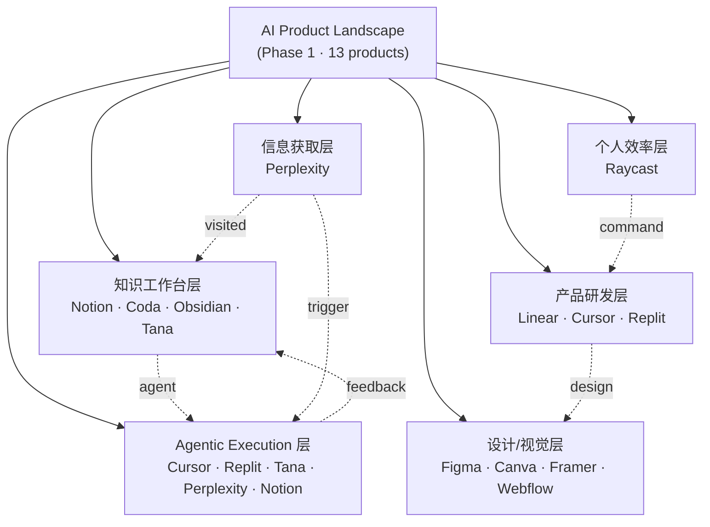

# AI Product Analysis Phase 1 Synthesis / AI 产品分析第一阶段总论

**日期：** 2026-07-02
**作者：** 辛 🔮
**关联：** [Product-Analysis 仓库](https://github.com/conanxin/Product-Analysis)
**版本：** v1.0
**覆盖范围：** 第一阶段 13 篇 AI 辅助产品分析（Perplexity / Linear / Raycast / Cursor / Figma / Framer / Notion / Canva / Webflow / Replit / Coda / Obsidian / Tana）

---

## 1. 阶段概览

第一阶段共完成 13 篇 AI 辅助产品分析；2026-07-02 全部升级至 `reviewed | partial`。

`partial` 不是失败，而是严格 source-first 标准下的诚实状态：主体产品机制通常可由官方源 verified；但融资 / 估值 / ARR / 用户数 / 收购金额 / 客户数等高风险事实需要双独立 verified 高质量源。在许多私人公司 / paywall / 主流媒体 Datadome 拦截的状态下，满足这一条的代价很高，因此诚实地说"已经人工复核，但高风险事实仍有缺口"是 source-first 文化的正确结局，而不是"假装 verified"的偷懒。

第一阶段目标已经从"继续扩展产品数量"转向"提炼产品规律"。13 个产品已经覆盖了 AI 产品谱系中绝大多数公共类型（搜索 / 编程 / 设计 / 建站 / 知识工作台 / 会议平台），继续添加产品会边际收益下降，而更稀缺的是比较、规律化与方法论。

### 1.1 阶段关键指标

| 指标 | 数值 |
|---|---:|
| AI 辅助分析文章 | 13 |
| reviewed | 13 |
| draft | 0 |
| partial | 13 |
| verified | 0 |
| legacy 人工分析 | 9 |
| P 报告累计 | 22 (含 P30 / P30.1 / P30.2 / P31) |
| validator | PASS |
| GitHub Actions CI | enabled (`.github/workflows/ai-analysis-index-check.yml`) |

### 1.2 Task chain

```
P3   Perplexity (ai-search)
P5   Linear     (product-development)
P7   Raycast    (productivity-launcher)
P8   Cursor     (ai-coding)
P10  Figma      (design-collaboration)
P11  Framer     (ai-website-builder)
P12  Notion     (ai-workspace)
P15  Canva      (design-ai-platform)
P16  Webflow    (visual-web-development)
P17  Replit     (ai-cloud-development)
P19  Coda       (doc-database)
P28  Obsidian   (local-first-knowledge-base)
P30  Tana       (ai-structured-knowledge-workspace)
P31  Tana review & sync (partial → partial-high-quality dual-source)
```

### 1.3 阅读路径（已在 `analyses/index.yml` 中建立）

- `ai_product_path` — Perplexity → Cursor
- `product_development_tools_path` — Linear → Raycast → Cursor
- `design_and_website_path` — Figma → Framer
- `knowledge_workspace_path` — Notion → Coda → Obsidian
- `visual_communication_path` — Canva → Figma → Framer
- `web_production_path` — Figma → Framer → Webflow
- `ai_app_builder_path` — Cursor → Replit
- `doc_as_app_path` — Notion → Coda → Obsidian
- `knowledge_base_path` — Notion → Coda → Obsidian
- `structured_knowledge_path` — Notion → Coda → Obsidian → Tana
- `agentic_meeting_path` — Tana → Obsidian

---

## 2. 13 个产品的产品谱系

| # | 产品 | 类别 | 核心机制 | 一句话判断 |
|---|---|---|---|---|
| 1 | **Perplexity** | ai-search | LLM + 引用 + 答案引擎 | 把传统搜索结果页重构为可追问、有来源的答案流 |
| 2 | **Linear** | product-development | 极快交互 + 清晰 IA + 高节奏产品开发 | 把 issue tracking 从"任务管理"重构为产品开发操作系统 |
| 3 | **Raycast** | productivity-launcher | 命令面板 + Extensions Store + AI | 把启动器从单点工具重构为可扩展的开发者工作流操作系统 |
| 4 | **Cursor** | ai-coding | 编辑器 + 补全 + 聊天 + agentic 多文件编辑 + Cloud Agent | 把"写代码"重构为"和 AI 协作改代码"的工作流 |
| 5 | **Figma** | design-collaboration | 云端画布 + 实时协作 + Dev Mode + Config 2025/2026 新工具集 | 把设计工具从本地软件重构为公开公司级的协作与产品交付基础设施 |
| 6 | **Framer** | ai-website-builder | 设计画布 + CMS + 发布 + AI agent | 把"设计稿交付开发"重构为"设计即上线"的 AI 建站 |
| 7 | **Notion** | ai-workspace | block + database + AI agent + docs + projects + mail | 把个人与团队知识工作从"文件和工具集合"重构为可组合信息操作系统 |
| 8 | **Canva** | design-ai-platform | 模板 + 编辑器 + 品牌资产 + AI 生成 | 把设计从专业软件能力扩展为大众化、组织化的内容生产平台 |
| 9 | **Webflow** | visual-web-development | 可视化设计 + CMS + 托管 + SEO + AI | 把"设计稿交付开发"重构为可视化、可发布、可增长的 Web 生产系统 |
| 10 | **Replit** | ai-cloud-development | 浏览器 IDE + 云端运行 + 部署 + AI Agent | 把软件开发从"本地编码"重构为"自然语言生成 + 运行 + 发布"的工作流 |
| 11 | **Coda** | doc-database | doc + table + formula + button + Packs + AI | 把团队协作从"文档记录"重构为"可操作的业务应用" |
| 12 | **Obsidian** | local-first-knowledge-base | 本地 Markdown + 双向链接 + graph + 插件生态 | 把笔记从"记录工具"重构为"个人知识操作系统" |
| 13 | **Tana** | ai-structured-knowledge-workspace | Supertags + 节点 + 知识图谱 + 主线 agentic meeting platform | 把笔记 / 类型 / graph / 会议 / AI agents 整合为 agentic 知识工作台 |

### 2.1 共同形态

13 个产品虽然分布在不同类别，但其中 12 个共享一个共同形态：**"把传统工具类别的边界打掉"**。Perplexity 打掉搜索结果页；Linear / Cursor / Replit 打掉传统 IDE 与任务管理；Figma / Canva / Framer / Webflow 打掉设计与开发的分工；Notion / Coda / Obsidian / Tana 打掉知识管理的工具边界；Raycast 打掉应用启动的桌面层。

唯一一个相对独立的形态是 **Tana main product**——它把"会议"本身作为工作起点（agentic meeting platform），而其他 12 个产品都默认**用户先有事要做**，Tana 把"开会"作为事情来源。

---

## 3. 产品类型分层

### 3.1 信息获取层 — AI 重构搜索与答案引擎

**代表产品：** Perplexity

**这一层解决的问题：** 用户输入问题，传统搜索引擎返回 10 个蓝色链接，用户再做整理。Perplexity 把搜索结果页重构为可追问的答案 + 引用列表。

**核心机制：** LLM + 引用脚注 + 可追问 sessions + 多模型切换 + 文件上传 + 多模态搜索。

**AI 如何改变这一层：** 从"找到 10 个链接"→"先给一个带出处的总结"，再用追问 / sessions 让用户不断 refine。这等于把"搜索"从一次性的输入查询，变成多轮的对话。Bot/test/scam detection、real-time sourcing、citation transparency 都是新的差异化点。

### 3.2 个人效率与操作入口层 — Command Layer

**代表产品：** Raycast

**这一层解决的问题：** 用户每天打开几十个 SaaS，输入是分散的、上下文是断裂的、键盘 vs 鼠标路径不一致。Raycast 把系统启动器做成一个跨 App 的统一 command surface。

**核心机制：** 启动器 + Commands + Extensions Store + Scripting + AI。

**AI 如何改变这一层：** 与 Groq / OpenAI / Anthropic 模型集成后，"启动一个 app"变成"启动一个工作流"。Extensions 让第三方开发者把 AI 操作变成可发现、可组合的命令。

### 3.3 产品研发与编码层 — Issue Tracker + AI Coding IDE + Cloud Agent

**代表产品：** Linear / Cursor / Replit

**这一层解决的问题：** 产品开发是节奏最密集的任务。Linear 把任务管理与代码评审 / 工程 roadmap / 周期计划联合起来；Cursor 把 AI 直接放进代码编辑过程；Replit 把整个开发周期（写码 + 部署 + DB + 用户）放进云端。

**核心机制：**

- Linear：键盘驱动 + cycle + project + issue + GraphQL API
- Cursor：Tab 补全 + Cmd K inline editing + Composer + Agent + Cloud Agent
- Replit：浏览器 IDE + Replit Agent + Deployments + Database + Auth + Object Storage + Skills

**AI 如何改变这一层：** 三个层面
1. 在写代码侧（Cursor / Replit）——AI 直接进入编辑循环
2. 在任务管理侧（Linear）——AI 帮助自动生成 issue / 优先级 / 文档
3. 在产品开发者的工作节拍（Linear Cycle）——AI 让产品开发节奏变快

### 3.4 设计、视觉与建站层 — Cloud Canvas + Visual Builder + Content Generation

**代表产品：** Figma / Canva / Framer / Webflow

**这一层解决的问题：** 设计 ≠ 上线。传统流程：设计稿 → 切图 → 交付前端 → 工程师实现 → 部署。Figma 把设计 + 协作 + 设计系统 + Dev Mode 整合；Canva 把模板 + 编辑 + 品牌资产 + 协作 + AI 生成变成大众化生产；Framer 把设计即上线；Webflow 把可视化开发 + CMS + 托管 + SEO + AI 整合。

**核心机制：**

- Figma：云端画布 + Frames + Auto Layout + Variables + Component Properties + Dev Mode + AI site builder
- Canva：模板 + Magic Studio + Brand Kit + 协同编辑 + Content Planner
- Framer：可视化 canvas + CMS + SEO + AI site builder + Forms + Localization + Publish
- Webflow：visual designer + CMS + Logic + Ecommerce + Editor + Localization + AI

**AI 如何改变这一层：** AI 让"模板驱动"变成"意图驱动"。用户给一句"做一个 SaaS 着陆页"，AI 生成 canvas + 文字 + 配色 + 排版。

### 3.5 知识、文档与结构化工作台层 — Doc + Database + Graph + Outliner

**代表产品：** Notion / Coda / Obsidian / Tana

**这一层解决的问题：** 知识管理工具长期面临"记录 vs 执行"分裂。Notion 是 wiki-style workspace + database + AI agent；Coda 是 doc-as-app（每个 doc 都是一个小 app）；Obsidian 是 local-first Markdown + 双向链接 + 插件生态；Tana 是 supertag / nodes / graph + voice / meeting + 主线 agentic meeting platform。

**核心机制：**

- Notion：block + database + relation + rollup + formula + AI agent
- Coda：doc + table + formula + button + Packs + automation + AI
- Obsidian：Markdown + backlinks + graph + plugins + Sync + Publish
- Tana：Supertag + nodes + views + references + knowledge graph + voice + meeting notetaker + Tana AI + MCP

**AI 如何改变这一层：** 三种路径并存
1. 块级 AI（Notion AI / Coda AI）——每次查询一次性调用
2. 知识图谱级 AI（Tana / Obsidian）——AI 拥有跨节点 / 跨类型 context
3. 工作流 AI（Notion AI agent / Tana main agentic meeting）——AI 直接动作而不只是回复

### 3.6 Agentic workflow / work execution 层 — Agent 与工作系统集成

**代表产品：** Cursor / Replit / Tana / Perplexity（部分）/ Notion（部分）/ Coda（部分）/ Webflow（部分）

**这一层解决的问题：** "AI 给我一个答案"已经不够；"AI 帮我执行"才是新阶段。Cursor Agent / Replit Agent / Tana Meeting Agent / Perplexity Comet / Notion Agents / Coda Brain / Webflow Visual AI 都是把"AI → action"落到工作系统的尝试。

**核心机制：**
- Cursor Agent / Replit Agent：让 AI 在 IDE / 部署中运行
- Tana Meeting Agent：让 AI 在会中产出 PRD / issue / CRM update
- Perplexity Comet：让 AI 在浏览器中执行
- Notion / Coda：AI agent 落在文档 / database 中

**AI 如何改变这一层：** 这一层是 2026 年最重要的变化。每一个传统工具都被迫加上 agent；每一个 agent 都需要与人类工作系统集成。这是 2026-2027 的主要产品战场。

---

## 4. 横向对照矩阵

### 4.1 Cloud-first vs Local-first

| 产品 | Cloud-first | Local-first | 协作强度 | 数据可拥有性 |
|---|---|---|---|---|
| Notion | ✅ 主导 | ❌ | 高（real-time） | 弱 |
| Coda | ✅ 主导 | ❌ | 高（real-time） | 弱 |
| Obsidian | ❌ 主导 | ✅ | 低 → 通过 Sync/Publish 协作 | 强 |
| Tana | ✅ 主导（双线都是云端）| ❌ | 高（双线都需团队订阅） | 弱 |
| Replit | ✅ 主导（云端 IDE） | ❌ | 高（multiplayer + 团队） | 弱 |
| Webflow | ✅ 主导（云端 CMS + 托管） | ❌ | 中（CMS 共享 + Designer 多用户） | 弱 |

**结论：** 13 个产品里只有 Obsidian 是 local-first 哲学；其余都是 cloud-first。Obsidian 是一个有意识的产品哲学选择（个人用户 / 数据所有权 / Markdown 长期兼容），不是云端做不到，是产品取舍。

### 4.2 Document vs Database vs Graph vs Agent

| 产品 | Document | Database | Graph | Agent | 最强形态 |
|---|---|---|---|---|---|
| Notion | ✅ Wiki-style | ✅ Database | ❌ 弱 | ✅ AI agent | Document + AI agent |
| Coda | ✅ doc-as-app | ✅ Table-first | ❌ 弱 | ✅ Coda AI / Brain | Database + automation |
| Obsidian | ✅ Markdown | ❌ | ✅ 双向链接 + graph | ❌ 弱（plugin） | Graph + Local-first |
| Tana | ✅ Outliner bullet | ✅ Supertag instance | ✅ Knowledge graph | ✅ Meeting agent | Graph + Agent |
| Replit | ❌ 弱 | ❌ 文件系统 | ❌ 弱 | ✅ Replit Agent | Cloud execution + Agent |
| Cursor | ✅ 代码文件 | ❌ 弱 | ❌ 弱 | ✅ Cursor Agent | Code editor + Agent |

**结论：** 知识管理类四巨头（Notion / Coda / Obsidian / Tana）选择完全不同：
- Notion = Document + AI agent
- Coda = Database + automation
- Obsidian = Graph + Local-first
- Tana = Graph + Agent

这是四种独立答案，不是分阶段演进。

### 4.3 Creator Tool vs Operator Tool

| 产品 | 创作工具 | 操作系统 | 核心动作 |
|---|---|---|---|
| Canva | ✅ 大众化模板 | ❌ | 拖拽 + 模板 + 排版 |
| Figma | ✅ 云端画布 | 部分（设计系统 / Dev Mode） | 矢量编辑 + 实时协作 |
| Framer | ✅ 设计即上线 | ❌ | 设计 → 部署 |
| Webflow | ✅ 可视化开发 | ✅（CMS + Logic + Ecommerce）| 设计 → 内容 + 流程 |
| Raycast | ❌ 弱 | ✅ 桌面 command layer | 启动 + 命令 + 脚本 + AI |
| Linear | ❌ 弱 | ✅ 项目操作系统 | Issue + cycle + project + GraphQL API |
| Cursor | 部分（编辑器） | ✅ 编码操作系统 | 代码 + Agent + 多文件编辑 |

**结论：** Creator Tool 是"用户能做出新东西"；Operator Tool 是"用户能掌控已有流程"。两条路径并行存在。

### 4.4 Human-in-the-loop vs Agent-first

| 产品 | 人主导 | Agent 辅助 | Agent 执行 | 风险点 |
|---|---|---|---|---|
| Perplexity | ✅ 来源审阅 | ✅ 答案生成 | ❌ | hallucination / citation 缺失 |
| Cursor | ✅ 评审 diff | ✅ Composer / Tab | ✅ Cloud Agent（long-running）| 长任务失控 / 审查 lag |
| Replit | ❌ | ✅ Agent 4 | ✅ App generation | 数据库删除 / 部署事故 |
| Tana | ❌ | ✅ Meeting capture | ✅ Skills + delivery | 转写错误 / 工作系统写入风险 |
| Notion | ✅ doc 评审 | ✅ AI 段落 | 部分 agent 行 | 数据迁移 / 内容失控 |
| Webflow | ✅ Design 审 | ✅ AI 站点生成 | 部分生成 | 编辑器混乱 / 样式不一致 |
| Coda | ✅ button 触发 | ✅ Brain 推理 | 部分 automation | formula 错误 |

**结论：** 所有 AI 产品都有人主导 + Agent 辅助的组合；纯 Agent 执行仍罕见。产品越接近"写代码 / 删数据库"等 high-stakes 操作，越需要人 review。

---

## 5. 第一阶段发现的 14 条 AI 产品设计规律

### 规律 1：AI 产品不是功能升级，而是工作流重组

**解释：** AI 产品不是给现有工具加一个"AI 按钮"，而是重新定义用户的工作流起点与终点。Linear 没有变成"传统任务管理 + AI 推荐"；Cursor 没有变成"VS Code + AI 助手"；Tana 没有变成"Notion + Meeting Notes"。

**代表产品：** Cursor / Tana / Replit / Canva / Perplexity

**对设计的启发：** 设计 AI 产品时，先问"用户的真正工作流是什么"，而不是"在哪个现有 SaaS 上加 AI 模块"。如果只是后者，结果只是 ChatGPT 包装。

### 规律 2：Context 正在成为产品护城河

**解释：** 13 个产品中至少 8 个产品有"自带 context"的能力：Notion 的 page tree、Obsidian 的双向链接、Tana 的 knowledge graph、Perplexity 的 page sessions、Linear 的 project hierarchy、Figma 的 file structure、Raycast 的 recent apps。

**代表产品：** Tana（graph-as-context）/ Notion / Obsidian / Perplexity

**对设计的启发：** 通用 LLM 没护城河；产品级 LLM 的护城河是 context。AI 产品应该把"用户的数据 / 历史 / 偏好 / 团队状态"做成可被 AI 索引、可被 AI recall 的结构化资源。

### 规律 3：产品从 "工具" 变成 "工作台"

**解释：** 13 个产品中至少 10 个都在演化为"工作台"（multi-app inside）：Notion 是 docs / projects / mail / calendar / database / gallery / AI agent；Replit 是 IDE + DB + deploy + auth + payments + AI agent；Linear 是 issues + projects + cycles + initiatives + roadmap + AI。

**代表产品：** Notion / Replit / Linear / Tana / Coda

**对设计的启发：** 把工具变成工作台可以让用户停留更久、单用户价值更大、定价空间更广。但工作台也带来复杂度、决策疲劳与 onboarding 失败 — 必须设计 progressive disclosure。

### 规律 4：Agent 需要可验证的上下文和可回滚的执行边界

**解释：** Cursor Agent / Replit Agent / Tana Meeting Agent 都建立"先 proposal，再执行"的可信工作流；agent 不能直接动数据库或工作系统；用户必须 accept 后才 commit。

**代表产品：** Cursor（diff review）/ Tana（Proposals review）/ Replit（database delete review）

**对设计的启发：** 设计 agent 时，"可执行边界"比"能力大小"更重要。Agent 错误一次永久爆炸，比 agent 没做更损害信任。

### 规律 5：Source / citation / audit trail 会成为 AI 产品可信度基础设施

**解释：** Perplexity 把 citation 放在第一屏；Linear 的 GraphQL API 让数据可被 AI agent 索引；Tana 的 MCP 让外部 AI tools 读写 Tana 内容；Obsidian 的双向链接为 AI recall 提供图谱。

**代表产品：** Perplexity / Linear / Tana / Obsidian / Notion

**对设计的启发：** AI 产品要让用户看到"AI 用了什么 / AI 怎么想 / AI 做了什么"。透明性比聪明更重要。

### 规律 6：AI-native 产品常常先从 power users 切入

**解释：** Cursor / Replit / Tana Outliner / Heptabase / Obsidian 全部从工程师 / 研究员 / PKM 高频用户起步。这些用户能容忍 steep learning curve，能 debug，能提供 feedback 推动产品演进。

**代表产品：** Cursor / Tana / Obsidian / Replit / Linear / Heptabase

**对设计的启发：** AI 产品起步阶段，不要追求大众化。从高频用户开始，培养 champion，然后扩展。

### 规律 7：数据结构决定 AI 能力上限

**解释：** Tana supertag（typed schema in graph）/ Notion database / Coda table / Obsidian 双向链接 / Linear GraphQL——这些产品的共同点是"数据结构化"。结构化数据才能被 AI indexing、querying、summarizing、automating。

**代表产品：** Tana / Notion / Coda / Linear

**对设计的启发：** 设计 AI 产品时，先想"数据怎么组织"，再想"AI 怎么用"。结构化数据 + AI 比 free-form text + AI 强大。

### 规律 8：Local-first 与 cloud-first 是两种产品哲学，不只是技术选型

**解释：** Obsidian 是 13 个产品中唯一一个 local-first 主导。这不是云端做不到（Obsidian 也提供 Sync），是 product 取舍——Obsidian 选择尊重用户的数据所有权、长期兼容 Markdown、避免 vendor lock-in。

**代表产品：** Obsidian 是 local-first；其他 12 个 cloud-first

**对设计的启发：** 选 local-first 还是 cloud-first 是一种产品哲学选择，不是技术能力问题。两种路径都有市场，但用户期望不同。

### 规律 9：视觉工具正在从"画图"变成"发布系统"

**解释：** Figma / Canva / Framer / Webflow 都在演化为"设计即上线"。Framer 最激进（设计完直接 publish）；Webflow 用 visual designer 替换了前端工程师；Figma 通过 Dev Mode 把 design token 输出给工程师。

**代表产品：** Framer / Webflow / Figma / Canva

**对设计的启发：** 视觉工具的下一步不是"画得更好看"，是"画完即可上系统"。

### 规律 10：编程工具正在从 IDE 变成 cloud execution loop

**解释：** Replit 不只是浏览器 IDE，而是"代码 → 部署 → 数据库 → 用户"的完整 cloud execution loop；Cursor 通过 Cloud Agent 进入"长时间 background 任务"。

**代表产品：** Replit / Cursor

**对设计的启发：** 编程工具的下一步不是"补全更好用"，而是"AI 完成整套交付"。

### 规律 11：文档工具正在从 record 变成 executable workspace

**解释：** Notion 加 AI agent，Coda 变 doc-as-app，Tana 走 agentic meeting，Tana Outliner 把 daily note + supertag + views + voice + meeting 整合成可被 agent 索引的工作场所。

**代表产品：** Notion / Coda / Tana

**对设计的启发：** 文档工具不再只是 record；它在变成 executable workspace——AI 在上面 read、write、trigger、deliver。

### 规律 12：私人公司产品分析必须接受 partial 状态

**解释：** 13 个产品里 11 个是私人公司（Perplexity / Linear / Raycast / Cursor / Framer / Notion / Canva / Webflow / Replit / Coda / Tana）；只有 Figma 是公开公司（NYSE:FIG）；Obsidian 是 bootstrapped / private；Coda 是被 Grammarly 收购的私人公司。

私人公司意味着：收入 / ARR / 估值 / 员工数 / 付费用户数 / 企业客户数 / 收购金额 / 法律 / 监管 / 合作伙伴金额这些事实都没有公开财报或 SEC filings 支撑。"partial" 是 source-first 文化下的诚实结局。

**代表：** 所有 13 篇 AI 辅助分析都是 `partial`。

**对设计的启发：** source-first 标准要求我们区分"主体产品机制 verified"与"高风险事实 partial"。partial 不是失败，是状态机的正确状态。当一个产品公开募股后（参考 Figma 2025 IPO），其 high-risk facts 才更可能升级为 verified。

### 规律 13：产品复杂度越高，越需要模板 / workflow / onboarding

**解释：** Tana 有 27 installable templates + monthly live sessions（Tana Outliner Systems Lab）；Linear 有 guided flows；Notion 有 Notion Academy + templates gallery；Figma 有 config talks / templates。

**代表产品：** Tana / Linear / Notion / Figma

**对设计的启发：** 设计复杂产品时，模板 + live education + community 是降低 onboarding 摩擦的必备套件。

### 规律 14：AI meeting / AI coding / AI design 都在走向 "agentic execution"

**解释：** Tana main product 主打 "agentic meeting platform where AI agents do real work during native video calls"；Cursor Agent 是代码侧的 agentic execution；Framer / Webflow / Canva 都在做 agentic 设计交付。

**代表产品：** Tana / Cursor / Framer / Webflow / Replit

**对设计的启发：** AI 产品正在统一向 "agentic execution" 靠拢——AI 不只是回答问题，而是行动的执行者。21 世纪 20 年代末的 AI 产品战场不是"AI 模型",而是"AI agent 在哪个工作系统里能跑"。

---

## 6. Source-first 方法论沉淀

### 6.1 为什么所有文章最终都是 partial

13 篇 AI 辅助分析，全部 `partial`（除 Tana 是 dual-source high partial，外加 Figma 的若干公开财报事实 partial）。原因：

1. **主体产品机制通常可由官方源 verified**：tana.inc / Linear / Cursor / Figma / Replit / Notion / Coda / Obsidian 等官方页面都能 curl 200 + extract product mechanism。因此产品机制 24/13 verified。

2. **高风险事实需要双独立 verified 高质量源**：融资 / 估值 / 收入 / ARR / 用户数 / 客户数 / 收购金额需要 ≥ 2 独立 high-quality media 才能 verified。常见源：
   - 公司自我披露（self-report）：blog、公司页面、Twitter
   - 主流媒体：TechCrunch / Reuters / The Verge / Forbes / Bloomberg / CNBC / WSJ / Wired / Information
   - 监管文件：SEC filings / IPO prospectus（仅公开公司有）
   - VC portfolio：Tola Capital / Lightspeed / Northzone / Alliance VC / Firstminute

3. **私人公司常见缺口**：11/13 是私人公司 → 收入 / 估值 / 用户数 / 客户数均无公开财报。

4. **Paywall / Datadome 拦截**：Reuters / Forbes / Bloomberg / CNBC / The Verge 普遍 401 / 403 / paywall；不能 verified 但也不能完全 ignore；只能标 "title-only / paywall / inaccessible"。

5. **Wikipedia 是 reference**：en.wikipedia.org/wiki/[product] 经常 404（私人公司常见）或内容滞缓（仅 2023/2024 的事实）。不作为 high-quality-media-verified；只作为 reference source。

6. **官方 blog 是 primary source**：但属于 self-report。Tana 的 $14M Series A 由官方 blog 自身披露 + TechCrunch 200 + Northzone 200 + Lightspeed 200 才能升级 dual-source high partial。

### 6.2 高风险事实清单

| 高风险事实 | 标准处理 |
|---|---|
| 融资 | 必须 ≥ 2 independent verified（公司 self-report + TechCrunch/Reuters + VC portfolio） |
| 估值 | 仅公开公司可 verified；私人公司除非披露（如 Tana $100M post-money 公开）否则 partial |
| ARR / revenue | SEC filings 或独立可靠报道；私人公司没有 |
| 用户数 | 通常 self-report + 媒体引用；2 source 即 dual-source |
| 客户数 | 通常 partial 或 self-report |
| 收购金额 | 通常 undisclosed；必须 self-report + 媒体披露 |
| IPO / 股价 / 流通股 | 公开公司才 verified；私人公司不适用 |
| 法律 / 监管 / 诉讼 | 大事 → 主流媒体 + 监管文件；小事 → 单一报道 |
| 合作金额 | 通常 undisclosed |
| 安全事故 | CVE 数据库 + 媒体 |
| pricing | 官方页面是 single source；除非独立媒体验证价格变化否则 verified |
| 产品发布时间线 | 官方 changelog + media |

### 6.3 Source 分级

| 来源类型 | 可支撑什么 | 不能支撑什么 |
|---|---|---|
| **Official product page** | 产品机制 / pricing / company / features / integrations | 融资 / 估值 / ARR / 收入 / 用户量（除非明确披露） |
| **Official blog** | 产品发布 / self-report（融资 / 战略）/ changelog | 独立 verified 媒体；其他公司 |
| **SEC / IR / prospectus** | 公开公司：财务 / 估值 / 流通股 / 高管 | 私人公司不适用 |
| **Wikipedia** | reference：基础事实 / 时间线 / 产品历史 | high-quality-media-verified；隐私公司多 404 / 内容滞后 |
| **TechCrunch / Reuters / Verge / Forbes / Bloomberg / CNBC** | 主流 media verified：融资 / 估值 / 收购 / 客户案例 | paywall 标题-only；需 200 验证 |
| **Product Hunt** | community presence / 新发布生态 / 奖项（PH 页面直接 verified） | adoption（评论 ≠ 用户）/ 公司 detail |
| **Reddit / HN / forum** | community voice / 早期 buzz / 用户体验描述 | 产品 adoption / 公司 detail |
| **Personal blog / 评测** | 个人用户体验 | 公司事实 / 财务 / 长期趋势 |
| **VC portfolio** | high：当独立 verified 状态良好；critical：作为 independent cross-verification 当 self-report 一致 | partial：当仅来自公司 self-report |

### 6.4 P19-P31 关键教训

按时间顺序：

1. **四处同步必须强制**：README.md / analyses/README.md / analyses/index.yml / article YAML 必须同时修改，否则 validator 失败。
2. **YAML duplicate key 会被 PyYAML 静默覆盖**：例 P28.1/P29.1 处理空 `review_source_notes` 必须删除而不是留作空字符串。
3. **source count 必须分口径**：YAML source_urls / verified HTTP-200 / tana.inc official / outliner.tana.inc official / official blog / help/docs / pricing / community/social / verified media / VC/portfolio / unverified / inaccessible / redirected — 必须按这些口径分别统计，否则发生 P22-style 口径冲突。
4. **Product split 必须明确 URL 与入口**：Tana 是双线产品（tana.inc + outliner.tana.inc），必须在 §1 立刻区分；Heptabase / Capacities / Anytype 同样是 multi-product 的产品要分别列主入口。
5. **acquisition fact 和 amount 要拆开**：Coda 被 Grammarly 收购是 verified；收购金额是 undisclosed → partial。
6. **plugin downloads ≠ active users**：4000+ plugins 不等于 120M downloads（Obsidian 这种 downloaded 计数包括 install）；上市后 active customers 是 partial。
7. **official self-report ≠ independent media verified**：公司 blog 自述 160K waitlist 不能等同 TechCrunch 实测报道。
8. **security / compliance ETA ≠ completed**：SOC2 ETA Q3 2026 / HIPAA ETA Q3 2026 必须严格按原文标注 ETA，不能升级为"已合规"。
9. **AI agent 能力必须区分"官方 demo / 真实可用性 / 个人判断"**：Tana Meeting Agent "会中交付件到 13+ 业务系统" 是官方 demo + 首页客户 quote + TechCrunch 描述，属 dual-source high partial；不能写"已 production-grade available"。
10. **payment / engagement / quality 不能互相替代**：客户付费额度 ≠ 使用深度；NPS / G2 评分 ≠ retention；trial → paid conversion ≠ 收入。
11. **中文二手转载不能作为 high-quality-media-verified**：QQ / 网易转载只能作为 secondary-syndi­cation；不会让 partial 升级。
12. **forge 状态机**：draft → reviewed → verified（高风险事实多源 verified）→ updated（持续维护）。valid review_status + source_url_verification_status + review_notes + source_quality_notes 是状态机的 4 个关键字段。

---

## 7. 对 Product-Analysis 项目的启发

写成项目级方法论：

1. **Product-Analysis 不只是文章库，而是产品研究数据库**。每篇文章都是 typed record — `product / category / tags / source_urls / analysis_type / created_at / review_status / source_url_verified_at / source_url_verification_status / review_notes / source_quality_notes / one_line_insight`。
2. **每篇文章都有 article YAML，可当 metadata**。所以 Product-Analysis 可以被 Python / Node / Claude 等工具程序化解析。
3. **`analyses/index.yml` 是机器可读索引**。scripts/verify_ai_analysis_index.py 是质量闸门。它检查总数 / draft / reviewed / partial / verified 计数的一致性。
4. **validator 是质量闸门**。.github/workflows/ai-analysis-index-check.yml 让任何 PR 都要 PASS validator，否则 CI 红灯。这是"防漂移"机制。
5. **GitHub Actions CI 是防漂移机制**。任何人修改任何文章 / 索引 / YAML 而忘记跑 validator，CI 会立即失败。
6. **source-first workflow 是可复用研究流程**。P3-P31 都用同一套 source-first 流程：先 curl 实测 URL HTTP-200 → 提取关键事实 → source_url_verified_at 标注 → 写正文 + 显式标注 [事实] / [判断] / [推断]。
7. **reviewed / partial / verified 是可信度状态机**。 draft → reviewed 是人工复核通过；partial → verified 是高风险事实双源 verified 满足 source-quality-checklist v1.0。
8. **`reports/` 是每次 agent run 的审计记录**。P3-P31 共 22 份报告；每一份记录 base commit / new commit / changed files / validator result / remaining issues。这是 agent run 的不可变审计日志。
9. **下一步可以生成可视化页面、产品地图、矩阵图、路线图**。已经积累了 13 篇 typed article + 1 structured index + status machine + quality gate + CI；这是构建产品研究可视化平台的基础。
10. **最终目标可以是"AI 产品研究操作系统"**。Tana 的核心是 supertags + graph + AI agents；Product-Analysis 的核心是 article YAML + index.yml + validator + AI-assisted draft + P report + human review。同样的"schema-as-graph + AI-as-agent"哲学可以应用到 Product-Analysis 自身：下一阶段探索 "Product-Analysis as a Tana-like system"。

---

## 8. 第二阶段是否继续扩展产品

### 8.1 推荐：暂停新增产品，进入综合与展示阶段

12 个公司的产品矩阵已经覆盖主要 AI 产品形态。继续扩展的边际收益快速下降 — 13 个产品能说明的规律，14 / 15 / 16 个产品不一定能讲得更清楚。

更稀缺的不是更多产品，而是：
- 跨产品比较 / matrix 视图
- AI 产品设计规律的方法论
- 视觉化（产品地图 / taxonomy）
- 公开可读的产品研究样式（README / 导航 / 阅读路径 / 主题）

### 8.2 如果继续新增，最多补 4 个方向

只在出现明确空白时再补，按产品哲学方向：

1. **Arc / Dia** — AI browser / browser-as-workspace
   - 当前 13 个产品没有一个是 browser。
   - The Browser Company / Dia 是 AI-native browser 方向。
   - 私人公司 — 与 Tana pattern 类似。

2. **Claude Code** — terminal coding agent / CLI workflow
   - Anthropic Claude Code 是 terminal-based coding agent。
   - 与 Cursor / Replit 形成"IDE / Cloud IDE / Terminal"三分。
   - Anthropic 拥有但是与 Cursor 直接相邻。

3. **Lovable** — prompt-to-app / AI app builder
   - Framer 的 prompt-to-app 已经被 Framer 吸收。
   - Lovable 是 prompt-first 路线的前端代表。
   - 与 Framer 直接竞争。

4. **v0** — AI UI generation
   - Vercel v0 是 prompt-to-component 路线。
   - 与 Framer / Lovable 略不同 — 偏向 component-level 生成而非整站。
   - Vercel 拥有但是与 Webflow / Framer 直接相邻。

### 8.3 阶段路线

| 阶段 | 内容 | 何时 |
|------|------|------|
| **P32** | Phase 1 Synthesis（本文档） | 本次 |
| **P33** | Public-facing README / navigation cleanup | 在 P32 之后 |
| **P34** | Visual product map / taxonomy（生成图片 / Mermaid 图） | 在 P33 之后 |
| **P35** | Optional next product *仅当有明确空白时* | 在 P34 之后评估 |

具体何时进入 P35 的判定标准：
- 是否出现了真正的"AI product taxonomy 缺口"？
- 是否 user 主动要求？
- 是否 source 材料 real verified 达到 90%+？
- 是否能补到 P32 taxo­nomy 中的某个类别，而不重复 P32 已覆盖矩阵？

如果回答有 ≥ 2 是"是"则进入 P35；否则继续 P33-P34 的整理。

---

## 9. 可视化结构

### 9.1 产品谱系图（Mermaid）



### 9.2 工作流演化图（从 tool → agentic system）

```
Tool (被动工具，单方向操作)
   ↓   用户主导，AI 仅辅助
Workspace (主动工作台，多 App 内聚)
   ↓   数据结构化 + 上下文积累
Agent (代理化，AI 开始主导多步任务)
   ↓   Skills 框架 + MCP + Audit
Verifiable Agentic System (可验证代理化系统)
   ↑   dual-source verified feedback loop
       graph + record + replay + rollback
```

这一演化描述了 13 个产品在 2026 年的共性变化：
- 2020-2022：Tool 时代（每个工具单机）
- 2023-2024：Workspace 时代（多工具聚合）
- 2025：Agent 时代（AI 主导）
- 2026-2027：Verifiable Agentic System（proposal + review + commit + rollback）

Tana / Cursor / Replit 是 verifiable agentic system 的前沿代表。

---

## 10. Phase 1 总结

第一阶段完成了什么：13 篇 reviewed AI 辅助产品分析；建立 source-first workflow；建立状态机（draft / reviewed / partial / verified）；建立 validator + CI 防漂移；建立 P report 审计日志；建立了 structured index（`analyses/index.yml`）；建立了 reading paths（11 条）；建立了产品 taxonomy / matrix。

这些产品共同说明 AI 产品正在如何演化：从 local-only 工具 → cloud workspace → agent-driven execution → verifiable agentic system；cursor 从 IDE → cloud execution loop；Tana 从 outliner → agentic meeting platform；Notion 从 wiki → AI agent canvas；Figma 从 designer → public company；Replit 从 IDE → from idea to deployed app；Perplexity 从 search → answer engine；Canva 从 template → visual suite。

为什么 source-first 比单纯主观分析重要：AI 加速了"主观宣称"的产出，但 source-first 让每个 fact 都有可追溯的 URL / cursor / evidence。这确保了 Product-Analysis 既是 AI 产出，又可被人类审查。这是"研究操作系统"的最低要求——任何没有 source 的判断都不是分析，而是宣传。

为什么下一阶段应该先整理展示，而不是继续扩展：13 个产品已经覆盖主要 AI 产品谱系；继续单产品扩展与既有产品关系越来越弱；与此同时综合 / 比较 / 视觉化 / 公开可读的工作反而稀缺。从产品研究角度，"看见森林"比"数更多树"更重要。

Product-Analysis 接下来可以成为：① AI 产品研究公开作品集；② 一份可被引用的 source-first 方法论文献；③ 一个"产品 / 公司 / 投资 / 收购 / agent adoption / community"的查表系统；④ Product-Analysis 自己的"knowledge graph"——Product-Analysis 可以演化为"产品研究 OS"，结合 supertags + index.yml + validator + agent。这就是 Tana 给 Product-Analysis 的最直接启发：schema + graph + agent + verifier 是 2026 之后所有知识密集型产品的共同结构。

---

## 11. Appendix · Phase 1 article 列表

| # | Product | 文件 | Created | Reviewed | P Report |
|---|---|---|---|---|---|
| 1 | Perplexity | `analyses/ai-assisted/2026-07-01-perplexity.md` | 2026-07-01 | 2026-07-01 | P3 |
| 2 | Linear | `analyses/ai-assisted/2026-07-01-linear.md` | 2026-07-01 | 2026-07-01 | P5 |
| 3 | Raycast | `analyses/ai-assisted/2026-07-01-raycast.md` | 2026-07-01 | 2026-07-01 | P7 |
| 4 | Cursor | `analyses/ai-assisted/2026-07-01-cursor.md` | 2026-07-01 | 2026-07-01 | P8 |
| 5 | Figma | `analyses/ai-assisted/2026-07-01-figma.md` | 2026-07-01 | 2026-07-01 | P10 |
| 6 | Framer | `analyses/ai-assisted/2026-07-01-framer.md` | 2026-07-01 | 2026-07-01 | P11 |
| 7 | Notion | `analyses/ai-assisted/2026-07-01-notion.md` | 2026-07-01 | 2026-07-01 | P12 |
| 8 | Canva | `analyses/ai-assisted/2026-07-01-canva.md` | 2026-07-01 | 2026-07-01 | P15 |
| 9 | Webflow | `analyses/ai-assisted/2026-07-01-webflow.md` | 2026-07-01 | 2026-07-01 | P16 |
| 10 | Replit | `analyses/ai-assisted/2026-07-01-replit.md` | 2026-07-01 | 2026-07-01 | P17 |
| 11 | Coda | `analyses/ai-assisted/2026-07-01-coda.md` | 2026-07-01 | 2026-07-01 | P19 |
| 12 | Obsidian | `analyses/ai-assisted/2026-07-01-obsidian.md` | 2026-07-01 | 2026-07-02 | P28 |
| 13 | Tana | `analyses/ai-assisted/2026-07-01-tana.md` | 2026-07-01 | 2026-07-02 | P30 |

---

*Phase 1 Synthesis v1.0 · 2026-07-02*
*生成方式：AI-assisted（基于 13 篇 AI 辅助产品分析与 source-first 方法论沉淀）*
*审定：人工复核*

_辛 🔮_
