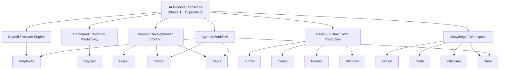
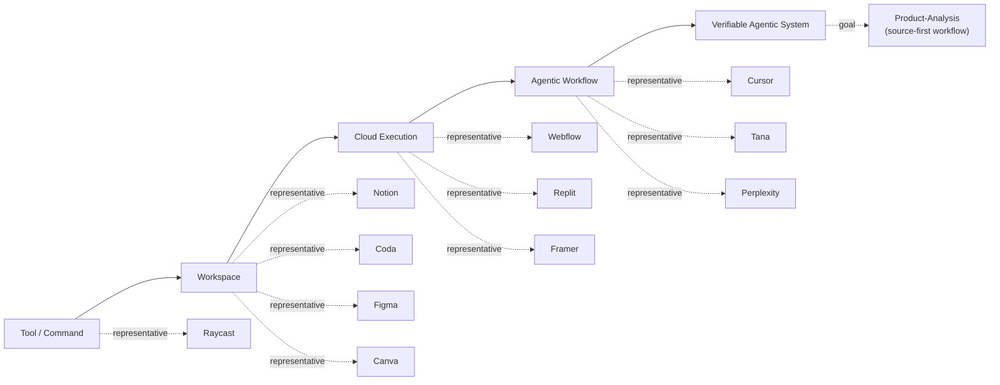
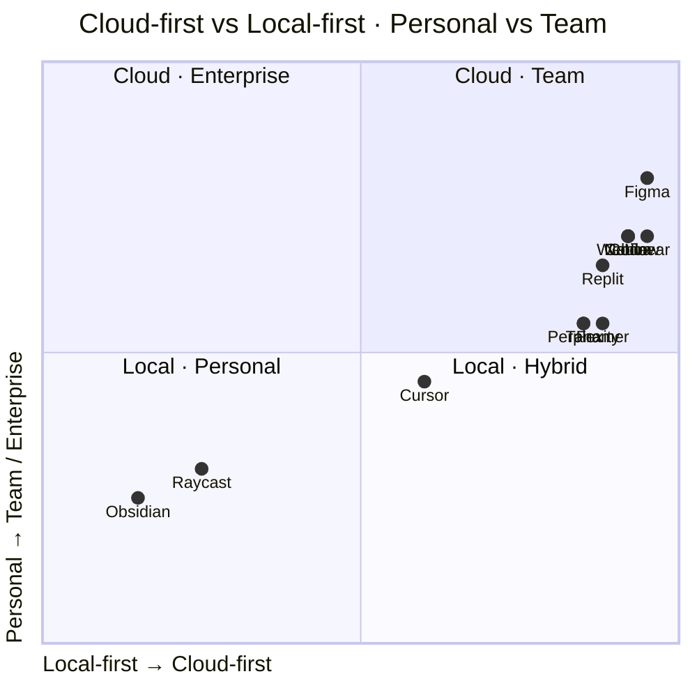
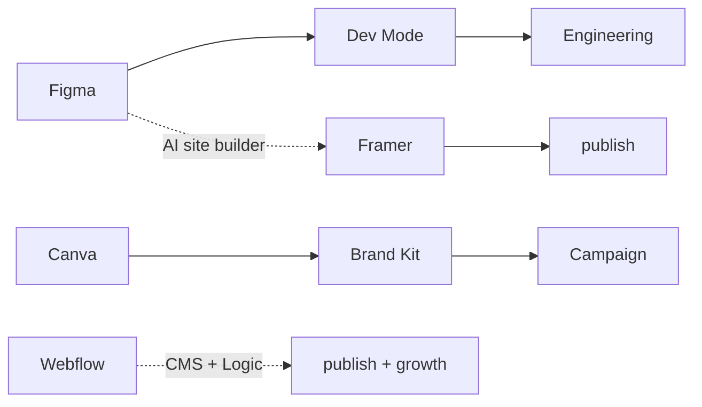
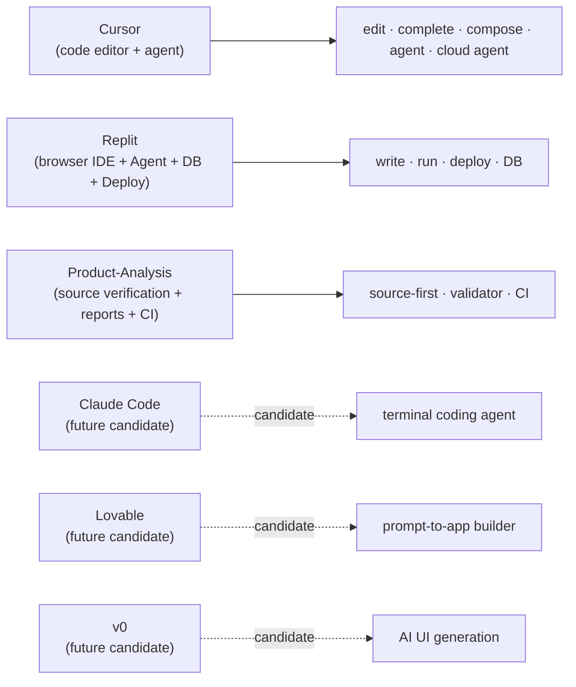
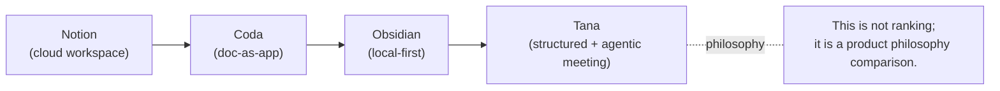
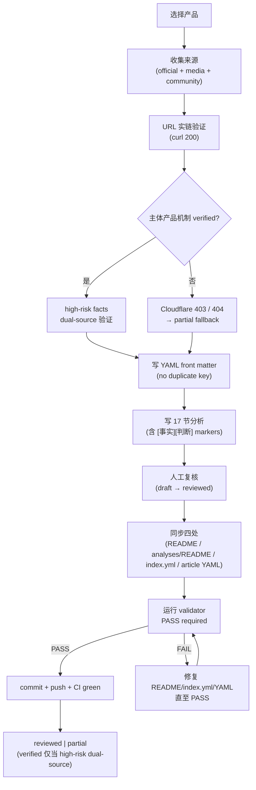

# Visual Product Map / AI 产品视觉图谱

**日期：** 2026-07-02
**关联：** [Phase 1 Synthesis](ai-product-analysis-phase-1-synthesis.md) · [Product Map Navigation](product-map-navigation.md) · [AI 辅助分析索引](../analyses/README.md) · [README](../README.md)

> 本文是 Phase 1 的视觉导航；不替代 Phase 1 Synthesis（综合规律）和 Product Map Navigation（按问题阅读）；适合快速理解 13 个产品之间的关系。Mermaid 图在 GitHub 中可直接渲染；ASCII fallback 便于纯文本阅读。

---

## 1. 产品图谱总览

13 个产品按 AI 产品类别的关系总览。



**解释 5 条：**

1. 中心节点 `AI Product Landscape` 表示 13 篇 Phase 1 分析覆盖的总谱系。
2. 6 个类别（Search / Command / Product Dev / Design / Knowledge / Agentic）反映了 §3 类型分层的 6 层结构。
3. Agentic Workflow 是一个"穿透型"层 — Cursor / Replit / Tana / Perplexity 同时被标记在 Dev / Knowledge 各自的核心类别下。
4. 与 Phase 1 Synthesis §3.6 一致：Agentic 不是独立产品，而是 2026 年所有 AI 产品的共同演化方向。
5. 阅读建议：从 Center 出发按与用户最相关的一个类别深入，再回到 Center 看其他类别。

---

## 2. 从 Tool 到 Agent 的演化图

13 个产品 + Product-Analysis 在 AI 产品演化时间轴中的位置。



**演化方向 4 条说明：**

1. AI 产品不是"加一个聊天框"；演化方向是从 tool 到 workspace，再到 cloud execution，再到 agentic execution，最后到 verifiable agentic system。
2. **Tool** 阶段：用户主导 AI 辅助。Raycast 是 command-layer tool。
3. **Workspace** 阶段：多 App 内聚。Notion / Coda / Figma / Canva 是工作台。
4. **Cloud Execution** 阶段：用户在云端即可发布。Webflow / Replit / Framer 是设计/开发/部署一体。
5. **Agentic Workflow** 阶段：AI 主导多步任务。Cursor / Tana / Perplexity 是当前前沿。
6. **Verifiable Agentic System** 阶段：AI 动作可被 audit、回滚、复查。Product-Analysis 用 source-first + validator + CI 是这个阶段的雏形。

---

## 3. Cloud-first vs Local-first 地图



**ASCII fallback 表格：**

| 产品 | Local-first | Cloud-first | Personal | Team | Enterprise | 说明 |
|---|---:|---:|---:|---:|---:|---|
| Obsidian | ✓ |  | ✓ | △ |  | local-first 哲学，Sync 可选 |
| Raycast | △ | △ | ✓ |  |  | mac 本地启动器 + 云扩展市场 |
| Tana |  | ✓ | △ | ✓ |  | 双线：tana.inc 团队 + outliner 个人 |
| Perplexity |  | ✓ | ✓ | △ | △ | 个人搜索为主，可团队订阅 |
| Framer |  | ✓ | ✓ | ✓ | △ | 设计即上线，云端发布 |
| Linear |  | ✓ | △ | ✓ | ✓ | 团队工作流，enterprise tier |
| Replit |  | ✓ | ✓ | ✓ | △ | 浏览器 IDE + 云端部署 |
| Notion |  | ✓ | △ | ✓ | ✓ | workspace 主导，multi-tier |
| Coda |  | ✓ | △ | ✓ | ✓ | doc-as-app，tier 多元 |
| Figma |  | ✓ | △ | ✓ | ✓ | 公开公司 + enterprise tier |
| Canva |  | ✓ | ✓ | ✓ | ✓ | 大众设计 + 团队 tier |
| Webflow |  | ✓ | △ | ✓ | ✓ | visual web development |
| Cursor | △ | △ | ✓ | △ | △ | 编辑器本地，云可选 |

> ⚠️ Mermaid quadrantChart 在 GitHub 渲染时坐标位置由插件处理，可能呈现与上表顺序略不同；ASCII fallback 是权威来源。

---

## 4. Document / Database / Graph / Agent 矩阵

| 产品 | Document | Database | Graph | Agent | 最强形态 |
|---|:---:|:---:|:---:|:---:|---|
| Notion | ✓ | ✓ | — | ✓ | Document + AI agent |
| Coda | ✓ | ✓ | — | △ | Database + automation |
| Obsidian | ✓ | — | ✓ | — | Graph + Local-first |
| Tana | ✓ | ✓ | ✓ | ✓ | Graph + Agent |
| Replit | — | △ | — | ✓ | Cloud execution + Agent |
| Cursor | △ | — | — | ✓ | Code editor + Agent |
| Perplexity | — | — | — | △ | Answer engine + citation |

**图例：** ✓ = 强支持；△ = 部分支持；— = 不强调

**解释 4 条：**

1. **数据结构决定 AI 能力上限** — 产品越结构化，AI 索引/查询/执行的能力越强。
2. **Notion = Document + AI agent**：block 与 database 同等重要，agent 是后期能力。
3. **Coda = Database + automation**：formula / button / Packs 把 doc 变 app。
4. **Obsidian = Graph + Local-first**：双向链接建立图谱，放弃 agent 是有意取舍。
5. **Tana = Graph + Agent**：supertag / node / view + meeting AI + Tana AI，是 4 个产品里唯一同时把 4 项齐备的产品。
6. **Replit / Cursor = Code editor + Agent**：从执行文件到 agent 主导多步任务。
7. **Perplexity = Answer engine + citation**：citation 是它与传统 LLM chat 的根本差异。

---

## 5. Design-to-Publish 工作流图



**解释 3 条：**

1. Figma 偏协作基础设施（Dev Mode → Engineering 是其核心价值）。
2. Canva 偏大众内容生产（Brand → Campaign）。
3. Framer 偏 AI website builder（design → publish）。
4. Webflow 偏 visual web development（CMS + Logic + Ecommerce + growth）。
5. 这条线说明视觉工具正在从"画图"走向"发布系统" — 即 Phase 1 Synthesis 规律 9。

---

## 6. AI Coding / App Builder 工作流图



**注意：** Claude Code / Lovable / v0 是 P35 候选方向，**未在 Phase 1 内分析**，在图中以 dashed 风格（`.candidate.`）表示，不得被视为已完成。

**解释 4 条：**

1. Cursor 工作流：edit · complete · compose · agent · cloud agent 5 层。
2. Replit 工作流：write → run → deploy → DB 一条环路。
3. Product-Analysis 工作流：source-first · validator · CI 构成 verifiable agentic system 雏形。
4. 候选方向（Claude Code / Lovable / v0）若进入 Phase 2 将进入 P35 评估。

---

## 7. Knowledge Workspace 路线图



**解释 5 条：**

1. **Notion** = cloud workspace：block + database + AI agent + docs + projects + mail。
2. **Coda** = doc-as-app：doc + table + formula + button + Packs + automation。
3. **Obsidian** = local-first knowledge base：Markdown + 双向链接 + graph + plugins。
4. **Tana** = structured knowledge + agentic meeting：supertag + 节点 + 知识图谱 + voice + meeting + Tana AI + MCP；当前 tana.inc 已转向 agentic meeting、outliner 单独保留为 Tana Outliner。
5. 这不是优劣排序；是产品哲学与数据结构演化对照 — 4 种独立答案。

---

## 8. Source-first 研究流程图



**流程节点 8 个要点：**

1. **来源分两阶段**：主体产品机制 verified → 主体可信，进入 §17；high-risk facts 需要 dual-source 才能升级 verified。
2. **Cloudflare 403 不是终点**：转 partial，用 TechCrunch / VC portfolio / VC Twitter 寻找 cross-verification。
3. **YAML duplicate key 会静默丢失**：P28.1 / P29.1 都因此纠正过；用 PyYAML safe_load 验证。
4. **四处同步必须同时**：README / analyses/README / index.yml / article YAML 任意一处漏掉 validator 立即 FAIL。
5. **partial 不是失败**：是 source-first 文化下的诚实状态机结果。13 篇 Phase 1 分析全部 partial，主要因为私人公司为主 + 高风险事实缺口。
6. **verified 是更稀有的状态**：只有高风险事实满足双独立 verified 才能从 partial → verified。
7. **validator 是质量闸门**：P24 + P25 CI 共同阻止漂移。
8. **CI 防漂移**：任何人改了索引/YAML 而忘记跑 validator，GitHub Actions CI 立即红灯。

---

## 9. ASCII fallback 总图

```text
AI Product Landscape (Phase 1 · 13 products)
├── Search
│   └── Perplexity                       AI search / answer engine
├── Command Layer
│   └── Raycast                          productivity launcher + AI
├── Product Development / Coding
│   ├── Linear                           issue tracking + cycle + GraphQL
│   ├── Cursor                           AI coding IDE + agent + cloud agent
│   └── Replit                           browser IDE + Agent + deploy
├── Design / Visual / Web
│   ├── Figma                            cloud canvas + Dev Mode + AI site builder
│   ├── Canva                            design AI + brand + content planner
│   ├── Framer                           AI website builder
│   └── Webflow                          visual web dev + CMS + Logic
└── Knowledge / Workspace / Agentic Meeting
    ├── Notion                           block + database + AI agent
    ├── Coda                             doc + table + formula + automation
    ├── Obsidian                          local-first Markdown + backlinks + plugins
    └── Tana                              supertag + graph + voice + meeting AI
                                          (tana.inc → agentic meeting platform
                                           outliner.tana.inc → Tana Outliner)

Cross-cutting layer:
└── Agentic Workflow
    └── Cursor · Replit · Tana · Perplexity
        (穿透于 Dev / Kno / Search 之上)
```

---

## 10. 如何使用这张图

1. **第一次读项目：** 先看 Product Map Navigation（按问题/路径阅读） → 再看本文 Visual Product Map（图谱导航）。
2. **深入方法论：** Phase 1 Synthesis §5 14 条规律 + §6 source-first 方法论。
3. **选产品对照：** 按 §4 (Document/Database/Graph/Agent)、§3 (Cloud vs Local)、§2 (Tool → Agent) 三图交叉读 13 篇 article。
4. **做产品研究：** 按 §8 Source-first workflow 流程图执行（收集 → 实链 → YAML → 17 节 → 复核 → 同步 → validator → CI）。
5. **做横向决策：** §5 Design-to-Publish + §6 AI Coding + §7 Knowledge Workspace 三图覆盖不同用户群。
6. **扩展第二阶段：** 优先检查是否真的有新空白，不要无止境扩展。
7. **如果新增产品：** 必须先通过 §8 流程 validator + CI + 与现有 13 篇同标准。

---

## 11. 关联文件

| 文件 | 内容 |
|------|------|
| [Phase 1 Synthesis](ai-product-analysis-phase-1-synthesis.md) | 13 篇综合、14 条规律、source-first 方法论 |
| [Product Map Navigation](product-map-navigation.md) | 按问题、按路线阅读 |
| [AI 辅助分析索引](../analyses/README.md) | 13 篇目录 + 阅读路径 + 质量状态 |
| [AI 辅助分析 YAML](../analyses/index.yml) | 机器可读索引 |
| [Source-first 质量标准](review-status-guide.md) | review_status / source_url_verification_status |
| [索引一致性校验](index-sync-validation.md) | validator 工作原理 |

---

*文档版本：v1.0 · 2026-07-02*
*关联项目：[Product-Analysis](https://github.com/conanxin/Product-Analysis)*

_辛 🔮_
